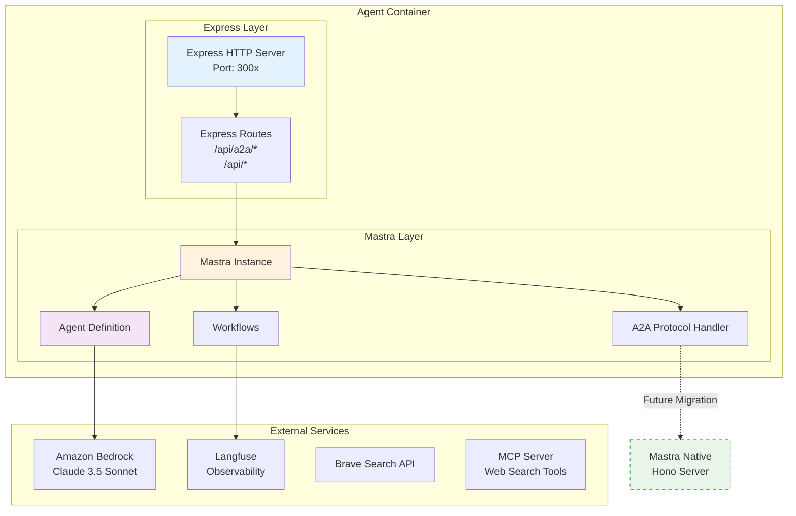
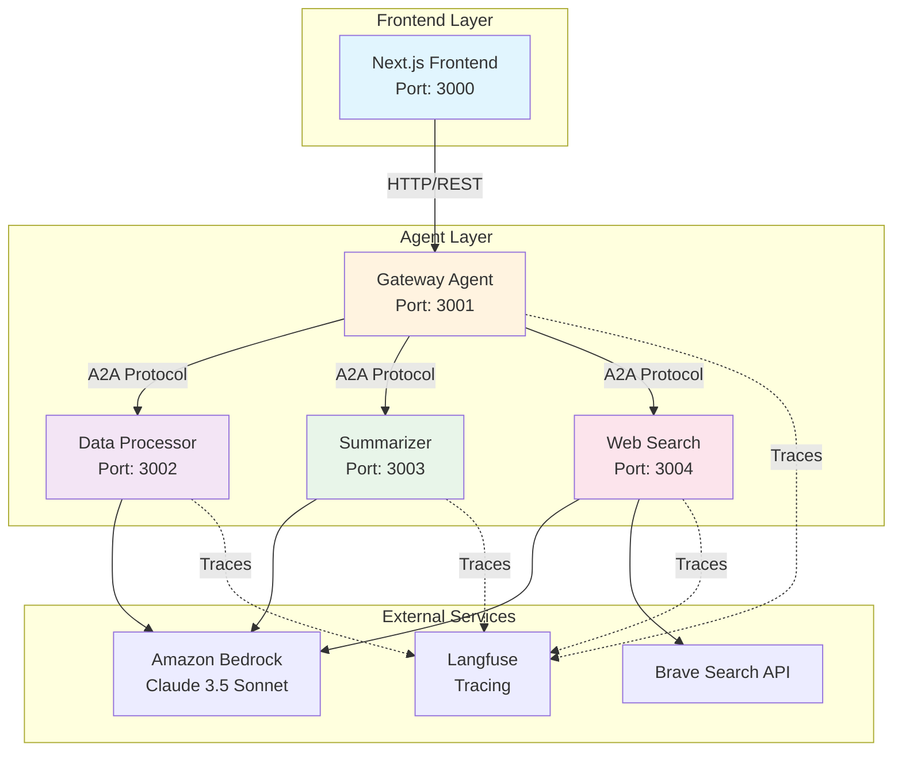
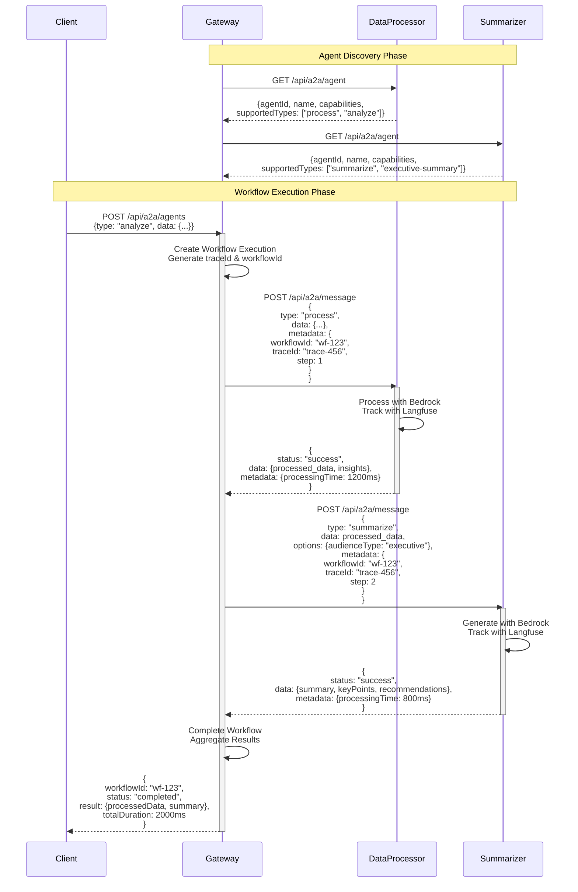
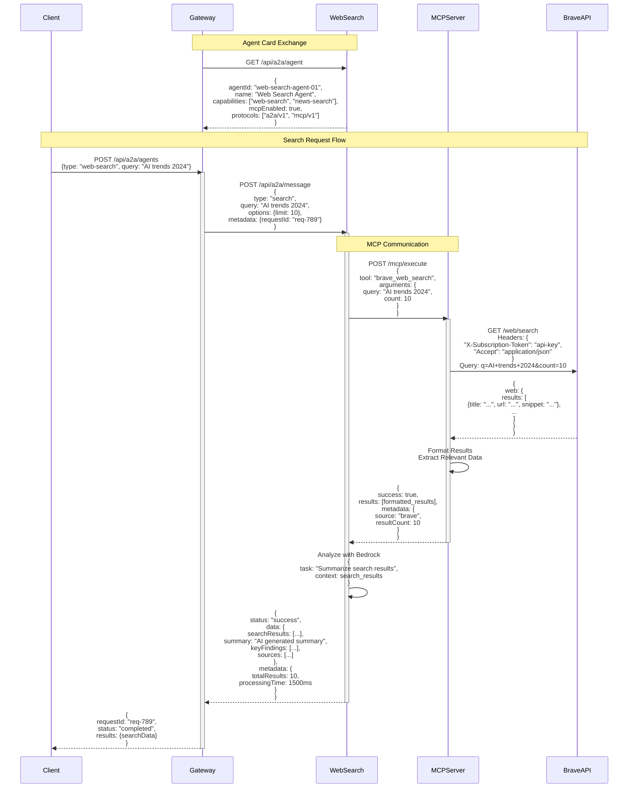
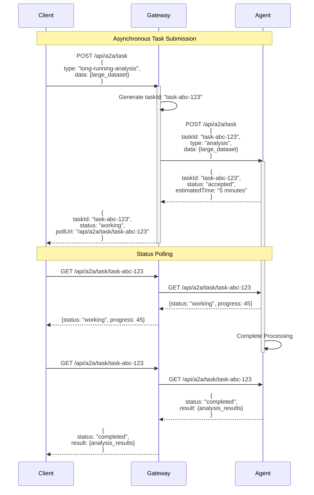

# A2A Mastra Demo - Multi-Agent System with Amazon Bedrock

A demonstration of Agent-to-Agent (A2A) communication protocol using the Mastra framework, featuring multiple specialized AI agents powered by Amazon Bedrock. This project showcases how autonomous agents can communicate, collaborate, and delegate tasks to achieve complex goals.

**Current Implementation**: Built with a hybrid Express + Mastra architecture, with plans to migrate fully to Mastra's native Hono-based API server in the future.


## 🏗️ Architecture Overview

The system consists of four specialized agents that communicate via the A2A protocol:

1. **Gateway Agent** - Request routing and workflow orchestration
2. **Data Processor Agent** - Data analysis and transformation
3. **Summarizer Agent** - Content summarization and insight extraction
4. **Web Search Agent** - Real-time web information retrieval

### Technology Stack
- **Framework**: Hybrid Mastra (A2A communication) + Express (HTTP server)
- **LLM**: Amazon Bedrock Claude 3.5 Sonnet
- **Language**: TypeScript
- **Frontend**: Next.js
- **Containerization**: Docker & Docker Compose
- **Observability**: Langfuse
- **Web Search**: Brave Search API + MCP (Model Context Protocol)

### Hybrid Architecture Overview



Each agent service follows this hybrid pattern:
- **Express Server**: Handles HTTP requests, CORS, middleware
- **Mastra Instance**: Manages agent logic, workflows, and inter-agent communication
- **Future State**: Migration to Mastra's native Hono-based server

### System Architecture



## 🚀 Features

- **Agent-to-Agent Communication**: Standardized A2A protocol for inter-agent messaging
- **Hybrid Architecture**: Express HTTP server with Mastra agent orchestration
- **Workflow Orchestration**: Complex multi-step workflows with automatic task delegation
- **Real-time Visualization**: Live visualization of agent communication flows
- **Tracing & Observability**: Comprehensive tracing with Langfuse integration
- **MCP Integration**: Model Context Protocol support for web search capabilities
- **Japanese Language Support**: All agents respond in Japanese
- **Containerized Deployment**: Docker-based microservices architecture

## 📋 Prerequisites

- Docker and Docker Compose
- Node.js 22+ (for local development)
- AWS Account with Bedrock access
- Langfuse account (optional, for tracing)
- Brave Search API key (optional, for web search)

## 🛠️ Installation

### 1. Clone the repository

```bash
git clone https://github.com/tubone24/a2a_mastra.git
cd a2a_mastra
```

### 2. Copy the environment variables

```bash
cp .env.example .env
```

### 3. Configure your `.env` file:
```env
# AWS Credentials for Amazon Bedrock
AWS_ACCESS_KEY_ID=your-access-key-id
AWS_SECRET_ACCESS_KEY=your-secret-access-key
AWS_REGION=us-east-1

# Bedrock Model
BEDROCK_MODEL_ID=anthropic.claude-3-5-sonnet-20240620-v1:0

# Langfuse (optional)
LANGFUSE_PUBLIC_KEY=your-public-key
LANGFUSE_SECRET_KEY=your-secret-key
LANGFUSE_BASEURL=https://cloud.langfuse.com

# Brave Search (optional)
BRAVE_SEARCH_API_KEY=your-api-key
```

### 4. Build and start the services

```bash
docker-compose up --build
```

## 🎯 Usage

Once the system is running, access the frontend at `http://localhost:3000`.

### Available Operations

1. **Data Processing** (`/api/a2a/agents` - type: process)
   - Analyzes and transforms data
   - Extracts patterns and insights

2. **Summarization** (`/api/a2a/agents` - type: summarize)
   - Creates concise summaries
   - Supports different audience types (technical, executive, general)

3. **Analysis Workflow** (`/api/a2a/agents` - type: analyze)
   - Combines data processing and summarization
   - End-to-end data analysis pipeline

4. **Web Search** (`/api/a2a/agents` - type: web-search)
   - Real-time web information retrieval
   - News and scholarly article search

5. **Deep Research** (`/api/a2a/agents` - type: deep-research)
   - Multi-step research workflow using asynchronous task processing
   - Combines web search, data processing, and summarization
   - Long-running tasks with progress tracking and status polling

### API Examples

```bash
# Analyze data with full workflow
curl -X POST http://localhost:3001/api/a2a/agents \
  -H "Content-Type: application/json" \
  -d '{
    "type": "analyze",
    "data": "Your data here",
    "options": {
      "audienceType": "executive"
    }
  }'

# Deep Research (Asynchronous)
curl -X POST http://localhost:3001/api/a2a/agents \
  -H "Content-Type: application/json" \
  -d '{
    "type": "deep-research",
    "topic": "AI trends in healthcare 2024",
    "options": {
      "depth": "comprehensive",
      "sources": ["web", "news", "academic"],
      "audienceType": "technical",
      "maxDuration": "10 minutes"
    }
  }'

# Response for Deep Research
{
  "taskId": "research-task-abc-123",
  "status": "initiated",
  "estimatedDuration": "8-10 minutes",
  "pollUrl": "/api/a2a/task/research-task-abc-123",
  "steps": {
    "total": 5,
    "current": 1,
    "phases": ["search", "analyze", "synthesize", "validate", "report"]
  }
}

# Poll for status
curl http://localhost:3001/api/a2a/task/research-task-abc-123
```

## 🔄 Communication Flows

### A2A Protocol

The system implements a standardized A2A protocol with three main endpoints:

1. **Message Endpoint** (`/api/a2a/message`) - Synchronous message exchange
2. **Task Endpoint** (`/api/a2a/task`) - Asynchronous task processing
3. **Agent Discovery** (`/api/a2a/agent`) - Agent capability discovery

### Workflow Sequence with Agent Discovery



### Web Search Flow with MCP Protocol Details



### Deep Research Multi-Agent Workflow (Asynchronous)

```mermaid
sequenceDiagram
    participant Client
    participant Gateway
    participant WebSearch
    participant DataProcessor
    participant Summarizer
    
    Note over Client,Summarizer: Phase 1: Research Initiation
    
    Client->>Gateway: POST /api/a2a/agents<br/>{<br/>  type: "deep-research",<br/>  topic: "AI in healthcare 2024",<br/>  options: {depth: "comprehensive"}<br/>}
    activate Gateway
    
    Gateway->>Gateway: Generate Research Plan<br/>taskId: "research-abc-123"<br/>phases: [search, analyze, synthesize]
    
    Gateway-->>Client: {<br/>  taskId: "research-abc-123",<br/>  status: "initiated",<br/>  phases: ["search", "analyze", "synthesize"],<br/>  pollUrl: "/api/a2a/task/research-abc-123"<br/>}
    
    Note over Gateway,Summarizer: Phase 2: Initial Web Search (Async)
    
    Gateway->>WebSearch: POST /api/a2a/task<br/>{<br/>  taskId: "search-sub-task-1",<br/>  type: "comprehensive-search",<br/>  query: "AI healthcare trends 2024",<br/>  options: {sources: ["web", "news"]}<br/>}
    activate WebSearch
    
    WebSearch-->>Gateway: {<br/>  taskId: "search-sub-task-1",<br/>  status: "accepted",<br/>  estimatedTime: "2-3 minutes"<br/>}
    
    Note over Client,WebSearch: Client Polling During Search Phase
    
    Client->>Gateway: GET /api/a2a/task/research-abc-123
    Gateway->>WebSearch: GET /api/a2a/task/search-sub-task-1
    WebSearch-->>Gateway: {status: "working", progress: 30, phase: "web-search"}
    Gateway-->>Client: {<br/>  status: "working",<br/>  currentPhase: "search",<br/>  progress: 30,<br/>  details: "Searching web sources..."<br/>}
    
    WebSearch->>WebSearch: Execute Multiple Searches<br/>- General AI healthcare<br/>- Recent developments<br/>- Market analysis
    
    WebSearch-->>Gateway: {<br/>  taskId: "search-sub-task-1",<br/>  status: "completed",<br/>  result: {<br/>    sources: 50,<br/>    articles: [...],<br/>    keyThemes: [...]<br/>  }<br/>}
    deactivate WebSearch
    
    Note over Gateway,Summarizer: Phase 3: Data Analysis (Async)
    
    Gateway->>DataProcessor: POST /api/a2a/task<br/>{<br/>  taskId: "analyze-sub-task-2",<br/>  type: "research-analysis",<br/>  data: {searchResults},<br/>  options: {analyzePatterns: true}<br/>}
    activate DataProcessor
    
    DataProcessor-->>Gateway: {<br/>  taskId: "analyze-sub-task-2",<br/>  status: "accepted",<br/>  estimatedTime: "3-4 minutes"<br/>}
    
    Client->>Gateway: GET /api/a2a/task/research-abc-123
    Gateway->>DataProcessor: GET /api/a2a/task/analyze-sub-task-2
    DataProcessor-->>Gateway: {status: "working", progress: 60, phase: "analysis"}
    Gateway-->>Client: {<br/>  status: "working",<br/>  currentPhase: "analyze",<br/>  progress: 60,<br/>  details: "Analyzing patterns and trends..."<br/>}
    
    DataProcessor->>DataProcessor: Deep Analysis<br/>- Pattern identification<br/>- Trend analysis<br/>- Data correlation<br/>- Statistical insights
    
    DataProcessor-->>Gateway: {<br/>  taskId: "analyze-sub-task-2",<br/>  status: "completed",<br/>  result: {<br/>    patterns: [...],<br/>    trends: [...],<br/>    insights: [...],<br/>    correlations: [...]<br/>  }<br/>}
    deactivate DataProcessor
    
    Note over Gateway,Summarizer: Phase 4: Synthesis & Report Generation (Async)
    
    Gateway->>Summarizer: POST /api/a2a/task<br/>{<br/>  taskId: "synthesis-sub-task-3",<br/>  type: "research-synthesis",<br/>  data: {searchResults, analysisResults},<br/>  options: {<br/>    reportType: "comprehensive",<br/>    audienceType: "technical"<br/>  }<br/>}
    activate Summarizer
    
    Summarizer-->>Gateway: {<br/>  taskId: "synthesis-sub-task-3",<br/>  status: "accepted",<br/>  estimatedTime: "2-3 minutes"<br/>}
    
    Client->>Gateway: GET /api/a2a/task/research-abc-123
    Gateway->>Summarizer: GET /api/a2a/task/synthesis-sub-task-3
    Summarizer-->>Gateway: {status: "working", progress: 85, phase: "synthesis"}
    Gateway-->>Client: {<br/>  status: "working",<br/>  currentPhase: "synthesize",<br/>  progress: 85,<br/>  details: "Generating comprehensive report..."<br/>}
    
    Summarizer->>Summarizer: Generate Research Report<br/>- Executive summary<br/>- Key findings<br/>- Trend analysis<br/>- Recommendations<br/>- Source citations
    
    Summarizer-->>Gateway: {<br/>  taskId: "synthesis-sub-task-3",<br/>  status: "completed",<br/>  result: {<br/>    executiveSummary: "...",<br/>    keyFindings: [...],<br/>    recommendations: [...],<br/>    fullReport: "...",<br/>    sources: [...]<br/>  }<br/>}
    deactivate Summarizer
    
    Gateway->>Gateway: Compile Final Results<br/>- Aggregate all findings<br/>- Create research timeline<br/>- Generate metadata
    
    Note over Client,Summarizer: Phase 5: Research Completion
    
    Client->>Gateway: GET /api/a2a/task/research-abc-123
    Gateway-->>Client: {<br/>  taskId: "research-abc-123",<br/>  status: "completed",<br/>  totalDuration: "8 minutes 23 seconds",<br/>  result: {<br/>    executiveSummary: "...",<br/>    detailedFindings: {...},<br/>    sourcesAnalyzed: 50,<br/>    trendsIdentified: 12,<br/>    recommendations: [...],<br/>    confidence: 0.92,<br/>    methodology: "multi-agent-research"<br/>  },<br/>  metadata: {<br/>    phases: ["search", "analyze", "synthesize"],<br/>    agentsUsed: ["web-search", "data-processor", "summarizer"],<br/>    processingTime: {<br/>      search: "2m 15s",<br/>      analysis: "3m 42s",<br/>      synthesis: "2m 26s"<br/>    }<br/>  }<br/>}
    deactivate Gateway
```



### Asynchronous Task Processing Flow



## 🔧 Development

### Project Structure

```
a2a-mastra-demo/
├── agents/                    # Agent services (Express + Mastra hybrid)
│   ├── gateway/              # Gateway agent with workflow orchestration
│   │   ├── src/
│   │   │   ├── index.ts      # Express server with Mastra integration
│   │   │   ├── mastra/       # Mastra agent definitions
│   │   │   └── routes/       # Express API routes
│   │   └── package.json      # Dependencies (express + @mastra/core)
│   ├── data-processor/       # Data processing agent
│   ├── summarizer/           # Summarization agent
│   └── web-search/          # Web search agent with MCP integration
├── frontend/                 # Next.js frontend
├── shared/                   # Shared types and utilities
├── standalone-mcp-server/    # Standalone MCP server for web search
└── docker-compose.yml        # Docker composition
```

### Current Architecture

Each agent service runs as a hybrid Express + Mastra application:
- **Express Server**: Handles HTTP requests and API routing
- **Mastra Instance**: Manages agent definitions, workflows, and A2A communication
- **Docker Container**: Isolated service deployment

### Local Development

Each agent can be run independently for development:

```bash
# Gateway Agent
cd agents/gateway
npm install
npm run dev

# Data Processor
cd agents/data-processor
npm install
npm run dev

# Continue for other agents...
```

### Migration Notes

The project is currently in a hybrid state and can be migrated to pure Mastra:
- Express routes → Mastra `registerApiRoute`
- Express server → Mastra's built-in Hono server
- Manual HTTP handling → Mastra's native A2A protocol

## 🔍 Monitoring & Debugging

### Langfuse Tracing

All agent interactions are traced in Langfuse. Access your traces at:
- EU: https://cloud.langfuse.com
- US: https://us.cloud.langfuse.com

### Docker Logs

Monitor agent logs:
```bash
# All services
docker-compose logs -f

# Specific agent
docker-compose logs -f gateway
```

## 🚢 Deployment(TBD)

The system is containerized and can be deployed to any Docker-compatible platform:

1. **AWS ECS/Fargate**
2. **Google Cloud Run**
3. **Azure Container Instances**
4. **Kubernetes**

Ensure all environment variables are properly configured in your deployment environment.

## 📄 License

This project is licensed under the MIT License - see the [LICENSE](LICENSE) file for details.

## 🙏 Acknowledgments

- [Mastra](https://mastra.ai) - The agent orchestration framework
- [Amazon Bedrock](https://aws.amazon.com/bedrock/) - AI/ML model hosting
- [Langfuse](https://langfuse.com) - LLM tracing and observability
- [MCP](https://modelcontextprotocol.io/) - Model Context Protocol