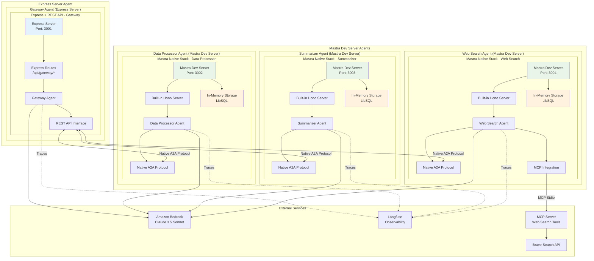
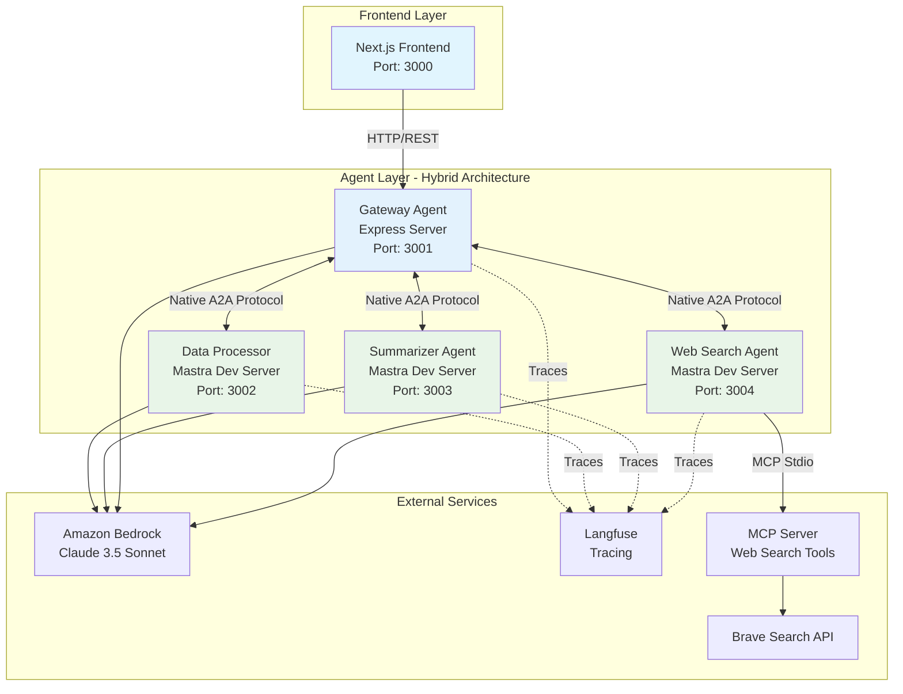
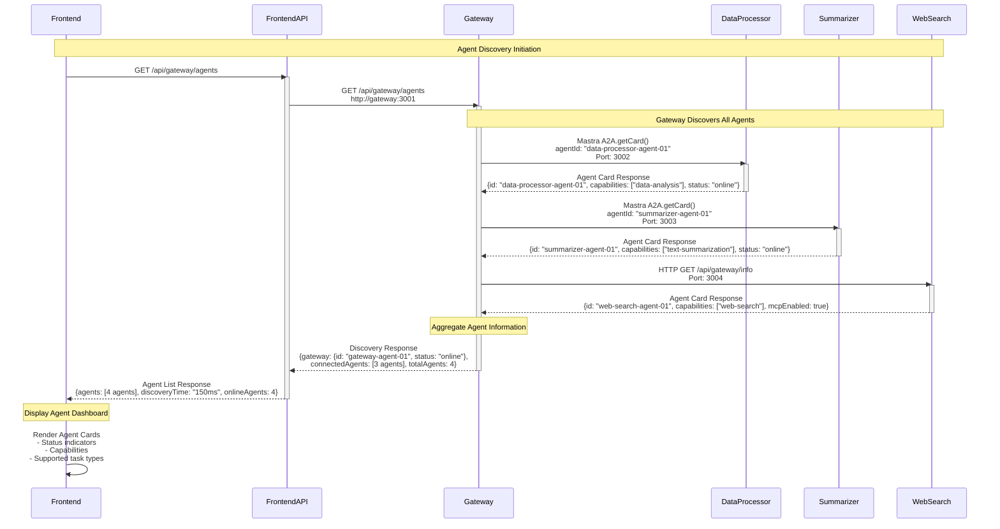
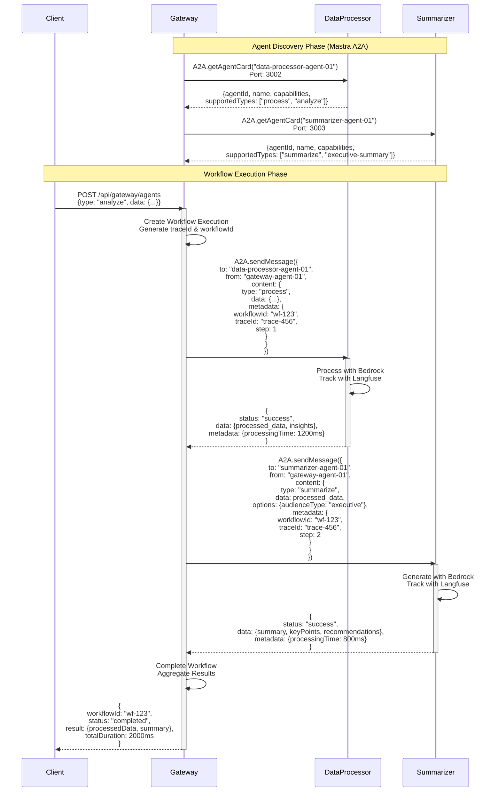
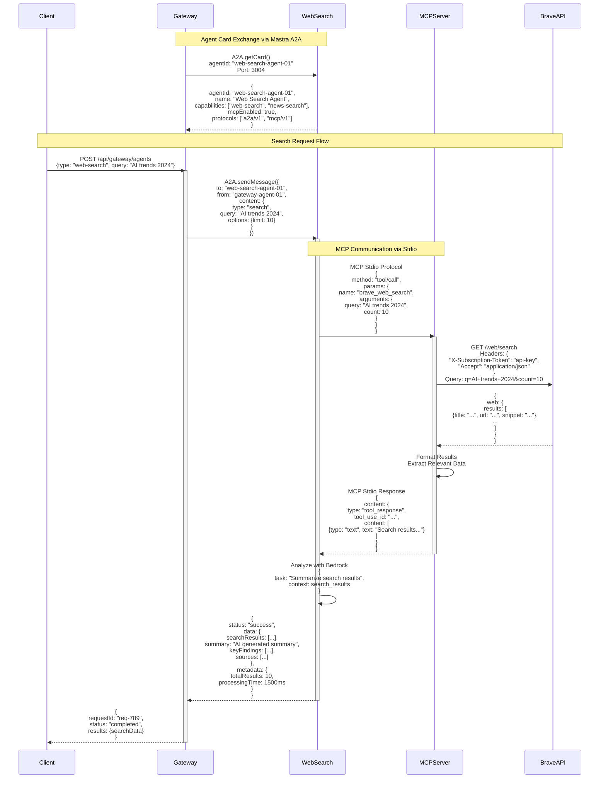

# A2A Mastra Demo - Multi-Agent System with Amazon Bedrock

A demonstration of Agent-to-Agent (A2A) communication protocol using the Mastra framework, featuring multiple specialized AI agents powered by Amazon Bedrock. This project showcases how autonomous agents can communicate, collaborate, and delegate tasks to achieve complex goals.

The system uses a hybrid architecture where Gateway agent(A2A Client Agent) runs on Express server with REST API implementation, while Data Processor, Summarizer, and Web Search agents use Mastra Dev Server with native A2A protocol.


## 🏗️ Architecture Overview

The system consists of four specialized agents that communicate via the A2A protocol

1. **Gateway Agent** - Request routing and workflow orchestration(A2A Client Agent)
2. **Data Processor Agent** - Data analysis and transformation(A2A Remote Agent)
3. **Summarizer Agent** - Content summarization and insight extraction(A2A Remote Agent)
4. **Web Search Agent** - Real-time web information retrieval(A2A Remote Agent)

### Technology Stack
- **Framework**: Hybrid Architecture - Gateway (Express Server + REST API) + Data Processor, Summarizer, Web Search (Mastra Dev Server)
- **LLM**: Amazon Bedrock Claude 3.5 Sonnet
- **Language**: TypeScript
- **Frontend**: Next.js
- **Containerization**: Docker & Docker Compose
- **Observability**: Langfuse
- **Web Search**: Brave Search API + MCP (Model Context Protocol)

### System Architecture Overview



**Architecture Features:**
- **Hybrid Implementation**: Gateway uses Express with REST API, Data Processor/Summarizer/Web Search use Mastra Dev Server
- **Mixed Communication Protocols**: REST API for Gateway, native Mastra A2A for other agents
- **Native Integration**: Data Processor, Summarizer, and Web Search agents use built-in Hono server and LibSQL storage
- **MCP Support**: Web Search agent integrates MCP protocol for external tool access

### Simplified System Architecture



## 🚀 Features

- **Hybrid API Communication**: REST API for Gateway, native Mastra A2A for Data Processor/Summarizer/Web Search
- **Mixed Architecture**: Express server for Gateway, Mastra Dev Server for Data Processor/Summarizer/Web Search
- **Workflow Orchestration**: Complex multi-step workflows with automatic task delegation
- **Real-time Visualization**: Live visualization of agent communication flows
- **Tracing & Observability**: Comprehensive tracing with Langfuse integration
- **MCP Integration**: Model Context Protocol support for web search capabilities
- **Japanese Language Support**: All agents respond in Japanese
- **Containerized Deployment**: Docker-based microservices architecture

## 📋 Prerequisites

- Docker and Docker Compose
- Node.js 22+ (for local development)
- AWS Account with Bedrock access
- Langfuse account (optional, for tracing)
- Brave Search API key (optional, for web search)

## 🛠️ Installation

### 1. Clone the repository

```bash
git clone https://github.com/tubone24/a2a_mastra.git
cd a2a_mastra
```

### 2. Copy the environment variables

```bash
cp .env.example .env
```

### 3. Configure your `.env` file
```env
# AWS Credentials for Amazon Bedrock
AWS_ACCESS_KEY_ID=your-access-key-id
AWS_SECRET_ACCESS_KEY=your-secret-access-key
AWS_REGION=us-east-1

# Bedrock Model
BEDROCK_MODEL_ID=anthropic.claude-3-5-sonnet-20240620-v1:0

# Langfuse (optional)
LANGFUSE_PUBLIC_KEY=your-public-key
LANGFUSE_SECRET_KEY=your-secret-key
LANGFUSE_BASEURL=https://cloud.langfuse.com

# Brave Search (optional)
BRAVE_SEARCH_API_KEY=your-api-key
```

### 4. Build and start the services

```bash
docker-compose up --build
```

## 🎯 Usage

Once the system is running, access the frontend at `http://localhost:3000`.

### Available Operations

1. **Data Processing** (`/api/gateway/agents` - type: process)
   - Analyzes and transforms data
   - Extracts patterns and insights

2. **Summarization** (`/api/gateway/agents` - type: summarize)
   - Creates concise summaries
   - Supports different audience types (technical, executive, general)

3. **Analysis Workflow** (`/api/gateway/agents` - type: analyze)
   - Combines data processing and summarization
   - End-to-end data analysis pipeline

4. **Web Search** (`/api/gateway/agents` - type: web-search)
   - Real-time web information retrieval
   - News and scholarly article search

5. **Deep Research** (`/api/gateway/agents` - type: deep-research)
   - Multi-step research workflow using asynchronous task processing
   - Combines web search, data processing, and summarization
   - Long-running tasks with progress tracking and status polling

### API Examples

```bash
# Analyze data with full workflow
curl -X POST http://localhost:3001/api/gateway/agents \
  -H "Content-Type: application/json" \
  -d '{
    "type": "analyze",
    "data": "Your data here",
    "options": {
      "audienceType": "executive"
    }
  }'

# Deep Research (Asynchronous)
curl -X POST http://localhost:3001/api/gateway/agents \
  -H "Content-Type: application/json" \
  -d '{
    "type": "deep-research",
    "topic": "AI trends in healthcare 2024",
    "options": {
      "depth": "comprehensive",
      "sources": ["web", "news", "academic"],
      "audienceType": "technical",
      "maxDuration": "10 minutes"
    }
  }'

# Response for Deep Research
{
  "taskId": "research-task-abc-123",
  "status": "initiated",
  "estimatedDuration": "8-10 minutes",
  "pollUrl": "/api/gateway/task/research-task-abc-123",
  "steps": {
    "total": 5,
    "current": 1,
    "phases": ["search", "analyze", "synthesize", "validate", "report"]
  }
}

# Poll for status
curl http://localhost:3001/api/gateway/task/research-task-abc-123
```

## 🔄 Communication Flows

### Agent Discovery

The system implements a centralized agent discovery mechanism through the Gateway agent. The discovery process allows agents to register their capabilities and discover other agents in the network.



### Gateway API Communication

The system implements REST API for Gateway and Mastra A2A protocol for other agents:

**For Express Server Agent (Gateway):**
1. **REST API Discovery** - HTTP endpoint `/api/gateway/info` for agent capability discovery
2. **REST API Message Exchange** - HTTP POST `/api/gateway/message` for synchronous communication
3. **REST API Task Management** - HTTP POST `/api/gateway/task` for asynchronous processing
4. **REST API Task Streaming** - HTTP GET `/api/gateway/task/{id}` for task progress polling

**For Mastra Dev Server Agents (Data Processor, Summarizer, Web Search):**
1. **Agent Discovery** - `A2A.getAgentCard(agentId)` - Agent capability discovery
2. **Message Exchange** - `A2A.sendMessage({to, from, content})` - Synchronous communication
3. **Task Management** - `A2A.createTask({agentId, taskType, payload})` - Asynchronous processing
4. **Task Streaming** - `A2A.streamTaskUpdates(taskId)` - Real-time task progress updates

### Workflow Sequence with Agent Discovery



### Web Search Flow with MCP Details



### Deep Research Multi-Agent Workflow (Asynchronous)

```mermaid
sequenceDiagram
    participant Client
    participant Gateway
    participant WebSearch
    participant DataProcessor
    participant Summarizer
    
    Note over Client,Summarizer: Phase 1: Research Initiation
    
    Client->>Gateway: POST /api/gateway/agents<br/>{<br/>  type: "deep-research",<br/>  topic: "AI in healthcare 2024",<br/>  options: {depth: "comprehensive"}<br/>}
    activate Gateway
    
    Gateway->>Gateway: Generate Research Plan<br/>taskId: "research-abc-123"<br/>phases: [search, analyze, synthesize]
    
    Gateway-->>Client: {<br/>  taskId: "research-abc-123",<br/>  status: "initiated",<br/>  phases: ["search", "analyze", "synthesize"],<br/>  pollUrl: "/api/gateway/task/research-abc-123"<br/>}
    
    Note over Gateway,Summarizer: Phase 2: Initial Web Search (Async)
    
    Gateway->>WebSearch: A2A.createTask({<br/>  agentId: "web-search-agent-01",<br/>  taskType: "comprehensive-search",<br/>  payload: {<br/>    query: "AI healthcare trends 2024",<br/>    options: {sources: ["web", "news"]}<br/>  }<br/>})<br/>Port: 3004
    activate WebSearch
    
    WebSearch-->>Gateway: {<br/>  taskId: "search-sub-task-1",<br/>  status: "accepted",<br/>  estimatedTime: "2-3 minutes"<br/>}
    
    Note over Client,WebSearch: Client Polling During Search Phase
    
    Client->>Gateway: GET /api/gateway/task/research-abc-123
    Gateway->>WebSearch: A2A.streamTaskUpdates("search-sub-task-1")
    WebSearch-->>Gateway: {status: "working", progress: 30, phase: "web-search"}
    Gateway-->>Client: {<br/>  status: "working",<br/>  currentPhase: "search",<br/>  progress: 30,<br/>  details: "Searching web sources..."<br/>}
    
    WebSearch->>WebSearch: Execute Multiple Searches<br/>- General AI healthcare<br/>- Recent developments<br/>- Market analysis
    
    WebSearch-->>Gateway: {<br/>  taskId: "search-sub-task-1",<br/>  status: "completed",<br/>  result: {<br/>    sources: 50,<br/>    articles: [...],<br/>    keyThemes: [...]<br/>  }<br/>}
    deactivate WebSearch
    
    Note over Gateway,Summarizer: Phase 3: Data Analysis (Async)
    
    Gateway->>DataProcessor: A2A.createTask({<br/>  agentId: "data-processor-agent-01",<br/>  taskType: "research-analysis",<br/>  payload: {<br/>    data: {searchResults},<br/>    options: {analyzePatterns: true}<br/>  }<br/>})<br/>Port: 3002
    activate DataProcessor
    
    DataProcessor-->>Gateway: {<br/>  taskId: "analyze-sub-task-2",<br/>  status: "accepted",<br/>  estimatedTime: "3-4 minutes"<br/>}
    
    Client->>Gateway: GET /api/gateway/task/research-abc-123
    Gateway->>DataProcessor: A2A.streamTaskUpdates("analyze-sub-task-2")
    DataProcessor-->>Gateway: {status: "working", progress: 60, phase: "analysis"}
    Gateway-->>Client: {<br/>  status: "working",<br/>  currentPhase: "analyze",<br/>  progress: 60,<br/>  details: "Analyzing patterns and trends..."<br/>}
    
    DataProcessor->>DataProcessor: Deep Analysis<br/>- Pattern identification<br/>- Trend analysis<br/>- Data correlation<br/>- Statistical insights
    
    DataProcessor-->>Gateway: {<br/>  taskId: "analyze-sub-task-2",<br/>  status: "completed",<br/>  result: {<br/>    patterns: [...],<br/>    trends: [...],<br/>    insights: [...],<br/>    correlations: [...]<br/>  }<br/>}
    deactivate DataProcessor
    
    Note over Gateway,Summarizer: Phase 4: Synthesis & Report Generation (Async)
    
    Gateway->>Summarizer: A2A.createTask({<br/>  agentId: "summarizer-agent-01",<br/>  taskType: "research-synthesis",<br/>  payload: {<br/>    data: {searchResults, analysisResults},<br/>    options: {<br/>      reportType: "comprehensive",<br/>      audienceType: "technical"<br/>    }<br/>  }<br/>})<br/>Port: 3003
    activate Summarizer
    
    Summarizer-->>Gateway: {<br/>  taskId: "synthesis-sub-task-3",<br/>  status: "accepted",<br/>  estimatedTime: "2-3 minutes"<br/>}
    
    Client->>Gateway: GET /api/gateway/task/research-abc-123
    Gateway->>Summarizer: A2A.streamTaskUpdates("synthesis-sub-task-3")
    Summarizer-->>Gateway: {status: "working", progress: 85, phase: "synthesis"}
    Gateway-->>Client: {<br/>  status: "working",<br/>  currentPhase: "synthesize",<br/>  progress: 85,<br/>  details: "Generating comprehensive report..."<br/>}
    
    Summarizer->>Summarizer: Generate Research Report<br/>- Executive summary<br/>- Key findings<br/>- Trend analysis<br/>- Recommendations<br/>- Source citations
    
    Summarizer-->>Gateway: {<br/>  taskId: "synthesis-sub-task-3",<br/>  status: "completed",<br/>  result: {<br/>    executiveSummary: "...",<br/>    keyFindings: [...],<br/>    recommendations: [...],<br/>    fullReport: "...",<br/>    sources: [...]<br/>  }<br/>}
    deactivate Summarizer
    
    Gateway->>Gateway: Compile Final Results<br/>- Aggregate all findings<br/>- Create research timeline<br/>- Generate metadata
    
    Note over Client,Summarizer: Phase 5: Research Completion
    
    Client->>Gateway: GET /api/gateway/task/research-abc-123
    Gateway-->>Client: {<br/>  taskId: "research-abc-123",<br/>  status: "completed",<br/>  totalDuration: "8 minutes 23 seconds",<br/>  result: {<br/>    executiveSummary: "...",<br/>    detailedFindings: {...},<br/>    sourcesAnalyzed: 50,<br/>    trendsIdentified: 12,<br/>    recommendations: [...],<br/>    confidence: 0.92,<br/>    methodology: "multi-agent-research"<br/>  },<br/>  metadata: {<br/>    phases: ["search", "analyze", "synthesize"],<br/>    agentsUsed: ["web-search", "data-processor", "summarizer"],<br/>    processingTime: {<br/>      search: "2m 15s",<br/>      analysis: "3m 42s",<br/>      synthesis: "2m 26s"<br/>    }<br/>  }<br/>}
    deactivate Gateway
```



## 🔧 Development

### Project Structure

```
a2a-mastra-demo/
├── agents/                    # Agent services (Express + Mastra hybrid)
│   ├── gateway/              # Gateway agent with workflow orchestration
│   │   ├── src/
│   │   │   ├── index.ts      # Express server with Mastra integration
│   │   │   ├── mastra/       # Mastra agent definitions
│   │   │   └── routes/       # Express API routes
│   │   └── package.json      # Dependencies (express + @mastra/core)
│   ├── data-processor/       # Data processing agent
│   ├── summarizer/           # Summarization agent
│   └── web-search/          # Web search agent with MCP integration
├── frontend/                 # Next.js frontend
├── shared/                   # Shared types and utilities
├── standalone-mcp-server/    # Standalone MCP server for web search
└── docker-compose.yml        # Docker composition
```

### Current Architecture

Agent services use a hybrid architecture

**Express Server Agent (Gateway):**
- **Express Server**: Node.js-based server (started with `node dist/index.js`)
- **REST API Protocol**: Standard HTTP-based REST API communication
- **Custom Storage**: Application-specific data management
- **Docker Container**: Isolated deployment for frontend communication

**Mastra Dev Server Agents (Data Processor, Summarizer, Web Search):**
- **Mastra Dev Server**: Hono-based native server (started with `mastra dev`)
- **Native A2A Protocol**: Mastra standard A2A communication protocol
- **In-Memory Storage**: In-memory storage via LibSQL
- **Docker Container**: Isolated deployment with native Mastra features

### Architecture Benefits

With the substantial migration to Mastra architecture:

**Achieved Benefits:**
- **Multi-Agent Modernization**: Data Processor, Summarizer, and Web Search agents use native Mastra A2A
- **Hybrid Flexibility**: Express with REST API for Gateway (frontend communication), Mastra for processing agents
- **MCP Protocol Support**: Advanced web search capabilities through Model Context Protocol
- **Unified Processing**: Consistent Mastra Dev Server for all data processing agents

**Future Enhancement Options:**
- **Complete Mastra Migration**: Migrate Gateway to Mastra Dev Server for full unification
- **Unified A2A Protocol**: Standardize on native Mastra A2A for all agents including Gateway
- **Production Storage**: Migrate to production-ready storage backends
- **Horizontal Scaling**: Implement multi-instance agent deployment

## 🔍 Monitoring & Debugging

### Langfuse Tracing

All agent interactions are traced in Langfuse. Access your traces at:
- EU: https://cloud.langfuse.com
- US: https://us.cloud.langfuse.com

### Docker Logs

Monitor agent logs:
```bash
# All services
docker-compose logs -f

# Specific agent
docker-compose logs -f gateway
```

## 🚢 Deployment(TBD)

The system is containerized and can be deployed to any Docker-compatible platform:

1. **AWS ECS/Fargate**
2. **Google Cloud Run**
3. **Azure Container Instances**
4. **Kubernetes**

Ensure all environment variables are properly configured in your deployment environment.

## 📄 License

This project is licensed under the MIT License - see the [LICENSE](LICENSE) file for details.

## 🙏 Acknowledgments

- [Mastra](https://mastra.ai) - The agent orchestration framework
- [Amazon Bedrock](https://aws.amazon.com/bedrock/) - AI/ML model hosting
- [Langfuse](https://langfuse.com) - LLM tracing and observability
- [MCP](https://modelcontextprotocol.io/) - Model Context Protocol
