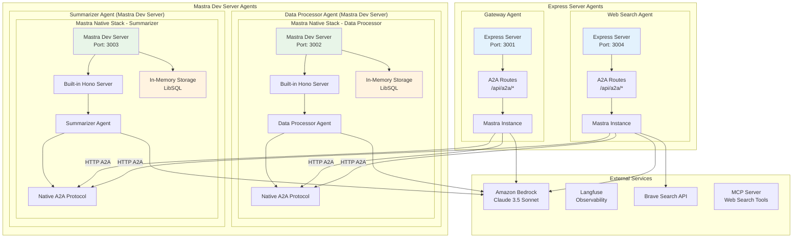

# A2A Mastra Demo - Multi-Agent System with Amazon Bedrock

A demonstration of Agent-to-Agent (A2A) communication protocol using the Mastra framework, featuring multiple specialized AI agents powered by Amazon Bedrock. This project showcases how autonomous agents can communicate, collaborate, and delegate tasks to achieve complex goals.

**Current Implementation**: Built with a hybrid Express + Mastra architecture, with plans to migrate fully to Mastra's native Hono-based API server in the future.


## 🏗️ Architecture Overview

The system consists of four specialized agents that communicate via the A2A protocol:

1. **Gateway Agent** - Request routing and workflow orchestration
2. **Data Processor Agent** - Data analysis and transformation
3. **Summarizer Agent** - Content summarization and insight extraction
4. **Web Search Agent** - Real-time web information retrieval

### Technology Stack
- **Framework**: Hybrid Architecture - Data Processor & Summarizer (Mastra Dev Server) + Gateway & Web Search (Express Server)
- **LLM**: Amazon Bedrock Claude 3.5 Sonnet
- **Language**: TypeScript
- **Frontend**: Next.js
- **Containerization**: Docker & Docker Compose
- **Observability**: Langfuse
- **Web Search**: Brave Search API + MCP (Model Context Protocol)

### Hybrid Architecture Overview



**アーキテクチャの特徴:**
- **Data Processor & Summarizer**: Mastra標準のDev Server（Hono）でA2A通信ネイティブサポート
- **Gateway & Web Search**: Express Server + 独自A2A実装によるHTTP通信
- **通信方式**: Data Processor・SummarizerはMastraネイティブA2A、Gateway・Web SearchはExpress実装

### Mastra標準A2Aで実現できなかった制約

このプロジェクトでは、Gateway・Web SearchエージェントではExpressサーバーによる独自A2A実装を採用し、Data Processor・SummarizerエージェントではMastra標準のDev Serverを使用しています。一部エージェントでExpress実装を採用しているのは、Mastra標準のDev ServerのA2A機能では以下の制約があったためです：

1. **Single Agent Per Instance制約**: Mastra Dev Serverは基本的に1つのエージェントインスタンス用に設計されており、複数エージェント間でのネットワーク分散通信に課題があった

2. **In-Memory Storage制限**: LibSQLによるメモリ内ストレージのため、エージェント間での永続的なタスク状態管理や長時間実行ワークフローの継続性に制限があった

3. **Production Deployment制約**: Mastra Dev Serverは主にローカル開発環境用で、Docker化された本番環境での複数コンテナ間通信には制約があった

4. **Custom Middleware Support**: CORS設定、独自認証、カスタムルーティングなど、本番環境で必要な柔軟なHTTPミドルウェア設定が困難だった

これらの制約により、Gateway・Web SearchエージェントではExpressサーバーによる独自A2A実装を採用し、Data Processor・SummarizerエージェントがMastra標準のA2A機能を使用する混合アーキテクチャとなっています。

### System Architecture

```mermaid
graph TB
    subgraph "Frontend Layer"
        UI[Next.js Frontend<br/>Port: 3000]
    end
    
    subgraph "Agent Layer"
        GW[Gateway Agent<br/>(Express Server)<br/>Port: 3001]
        DP[Data Processor<br/>(Mastra Dev Server)<br/>Port: 3002]
        SM[Summarizer Agent<br/>(Mastra Dev Server)<br/>Port: 3003]
        WS[Web Search Agent<br/>(Express Server)<br/>Port: 3004]
    end
    
    subgraph "External Services"
        BEDROCK[Amazon Bedrock<br/>Claude 3.5 Sonnet]
        LANGFUSE[Langfuse<br/>Tracing]
        BRAVE[Brave Search API]
    end
    
    UI -->|HTTP/REST| GW
    GW -->|Express A2A Implementation| DP
    GW -->|Express A2A Implementation| SM
    GW -->|Express A2A Implementation| WS
    
    DP --> BEDROCK
    SM --> BEDROCK
    WS --> BEDROCK
    WS --> BRAVE
    
    GW -.->|Traces| LANGFUSE
    DP -.->|Traces| LANGFUSE
    SM -.->|Traces| LANGFUSE
    WS -.->|Traces| LANGFUSE
    
    style UI fill:#e1f5fe
    style GW fill:#e3f2fd
    style DP fill:#e8f5e8
    style SM fill:#e8f5e8
    style WS fill:#e3f2fd
```

## 🚀 Features

- **Agent-to-Agent Communication**: Standardized A2A protocol for inter-agent messaging
- **Hybrid Architecture**: Express HTTP server with Mastra agent orchestration
- **Workflow Orchestration**: Complex multi-step workflows with automatic task delegation
- **Real-time Visualization**: Live visualization of agent communication flows
- **Tracing & Observability**: Comprehensive tracing with Langfuse integration
- **MCP Integration**: Model Context Protocol support for web search capabilities
- **Japanese Language Support**: All agents respond in Japanese
- **Containerized Deployment**: Docker-based microservices architecture

## 📋 Prerequisites

- Docker and Docker Compose
- Node.js 22+ (for local development)
- AWS Account with Bedrock access
- Langfuse account (optional, for tracing)
- Brave Search API key (optional, for web search)

## 🛠️ Installation

### 1. Clone the repository

```bash
git clone https://github.com/tubone24/a2a_mastra.git
cd a2a_mastra
```

### 2. Copy the environment variables

```bash
cp .env.example .env
```

### 3. Configure your `.env` file:
```env
# AWS Credentials for Amazon Bedrock
AWS_ACCESS_KEY_ID=your-access-key-id
AWS_SECRET_ACCESS_KEY=your-secret-access-key
AWS_REGION=us-east-1

# Bedrock Model
BEDROCK_MODEL_ID=anthropic.claude-3-5-sonnet-20240620-v1:0

# Langfuse (optional)
LANGFUSE_PUBLIC_KEY=your-public-key
LANGFUSE_SECRET_KEY=your-secret-key
LANGFUSE_BASEURL=https://cloud.langfuse.com

# Brave Search (optional)
BRAVE_SEARCH_API_KEY=your-api-key
```

### 4. Build and start the services

```bash
docker-compose up --build
```

## 🎯 Usage

Once the system is running, access the frontend at `http://localhost:3000`.

### Available Operations

1. **Data Processing** (`/api/a2a/agents` - type: process)
   - Analyzes and transforms data
   - Extracts patterns and insights

2. **Summarization** (`/api/a2a/agents` - type: summarize)
   - Creates concise summaries
   - Supports different audience types (technical, executive, general)

3. **Analysis Workflow** (`/api/a2a/agents` - type: analyze)
   - Combines data processing and summarization
   - End-to-end data analysis pipeline

4. **Web Search** (`/api/a2a/agents` - type: web-search)
   - Real-time web information retrieval
   - News and scholarly article search

5. **Deep Research** (`/api/a2a/agents` - type: deep-research)
   - Multi-step research workflow using asynchronous task processing
   - Combines web search, data processing, and summarization
   - Long-running tasks with progress tracking and status polling

### API Examples

```bash
# Analyze data with full workflow
curl -X POST http://localhost:3001/api/a2a/agents \
  -H "Content-Type: application/json" \
  -d '{
    "type": "analyze",
    "data": "Your data here",
    "options": {
      "audienceType": "executive"
    }
  }'

# Deep Research (Asynchronous)
curl -X POST http://localhost:3001/api/a2a/agents \
  -H "Content-Type: application/json" \
  -d '{
    "type": "deep-research",
    "topic": "AI trends in healthcare 2024",
    "options": {
      "depth": "comprehensive",
      "sources": ["web", "news", "academic"],
      "audienceType": "technical",
      "maxDuration": "10 minutes"
    }
  }'

# Response for Deep Research
{
  "taskId": "research-task-abc-123",
  "status": "initiated",
  "estimatedDuration": "8-10 minutes",
  "pollUrl": "/api/a2a/task/research-task-abc-123",
  "steps": {
    "total": 5,
    "current": 1,
    "phases": ["search", "analyze", "synthesize", "validate", "report"]
  }
}

# Poll for status
curl http://localhost:3001/api/a2a/task/research-task-abc-123
```

## 🔄 Communication Flows

### A2A Protocol

The system implements a standardized A2A protocol with three main endpoints:

1. **Message Endpoint** (`/api/a2a/message`) - Synchronous message exchange
2. **Task Endpoint** (`/api/a2a/task`) - Asynchronous task processing
3. **Agent Discovery** (`/api/a2a/agent`) - Agent capability discovery

### Workflow Sequence with Agent Discovery


### Web Search Flow with MCP Protocol Details


### Deep Research Multi-Agent Workflow (Asynchronous)


### Asynchronous Task Processing Flow


## 🔧 Development

### Project Structure

```
a2a-mastra-demo/
├── agents/                    # Agent services (Express + Mastra hybrid)
│   ├── gateway/              # Gateway agent with workflow orchestration
│   │   ├── src/
│   │   │   ├── index.ts      # Express server with Mastra integration
│   │   │   ├── mastra/       # Mastra agent definitions
│   │   │   └── routes/       # Express API routes
│   │   └── package.json      # Dependencies (express + @mastra/core)
│   ├── data-processor/       # Data processing agent
│   ├── summarizer/           # Summarization agent
│   └── web-search/          # Web search agent with MCP integration
├── frontend/                 # Next.js frontend
├── shared/                   # Shared types and utilities
├── standalone-mcp-server/    # Standalone MCP server for web search
└── docker-compose.yml        # Docker composition
```

### Current Architecture

エージェントサービスは混合アーキテクチャで実装されています：

**Data Processor & Summarizer Agents:**
- **Mastra Dev Server**: Honoベースのネイティブサーバー（`mastra dev`で起動）
- **Built-in A2A Protocol**: Mastra標準のA2A通信プロトコル
- **In-Memory Storage**: LibSQLによるメモリ内ストレージ

**Gateway & Web Search Agents:**
- **Express Server**: HTTPリクエスト処理とAPIルーティング
- **Mastra Instance**: エージェント定義、ワークフロー、独自A2A通信実装
- **Custom A2A Implementation**: Express経由の独自A2A実装

**Deployment:**
- **Docker Container**: 各サービスの分離デプロイメント

### Local Development

各エージェントは独立して開発できます：

```bash
# Data Processor (Mastra Dev Server)
cd agents/data-processor
npm install
npm run dev:mastra

# Summarizer Agent (Mastra Dev Server)
cd agents/summarizer
npm install
npm run dev:mastra

# Gateway Agent (Express Server)
cd agents/gateway
npm install
npm run dev

# Web Search Agent (Express Server)
cd agents/web-search
npm install
npm run dev
```

### Migration Notes

プロジェクトは現在、混合アーキテクチャ状態にあり、将来的にはMastra完全対応への移行が可能です：

**現在の状況:**
- Data Processor & Summarizer: Mastra標準A2A
- Gateway & Web Search: Express + 独自A2A実装

**将来の移行オプション:**
- Express routes → Mastra `registerApiRoute`
- Express server → Mastra built-in Hono server  
- Custom A2A implementation → Mastra native A2A protocol
- In-memory storage → Production-ready storage backends (PostgreSQL, Redis)

## 🔍 Monitoring & Debugging

### Langfuse Tracing

All agent interactions are traced in Langfuse. Access your traces at:
- EU: https://cloud.langfuse.com
- US: https://us.cloud.langfuse.com

### Docker Logs

Monitor agent logs:
```bash
# All services
docker-compose logs -f

# Specific agent
docker-compose logs -f gateway
```

## 🚢 Deployment(TBD)

The system is containerized and can be deployed to any Docker-compatible platform:

1. **AWS ECS/Fargate**
2. **Google Cloud Run**
3. **Azure Container Instances**
4. **Kubernetes**

Ensure all environment variables are properly configured in your deployment environment.

## 📄 License

This project is licensed under the MIT License - see the [LICENSE](LICENSE) file for details.

## 🙏 Acknowledgments

- [Mastra](https://mastra.ai) - The agent orchestration framework
- [Amazon Bedrock](https://aws.amazon.com/bedrock/) - AI/ML model hosting
- [Langfuse](https://langfuse.com) - LLM tracing and observability
- [MCP](https://modelcontextprotocol.io/) - Model Context Protocol